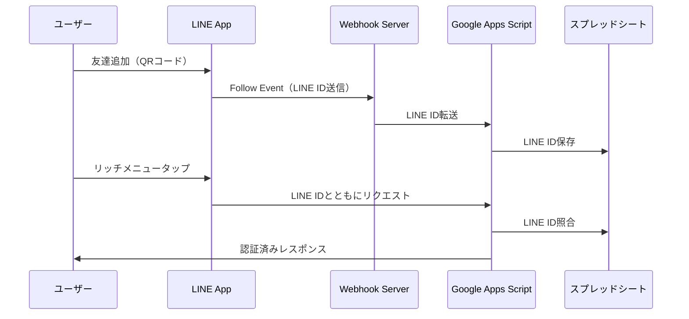

# CultiReFINE クリニック予約管理システム仕様書

## 1. システム概要

### 1.1 目的
CultiReFINEクリニックの予約管理システムは、Medical Force（MF）APIとLINE Botを統合し、会員制クリニックの予約管理と顧客管理を効率化するシステムです。

### 1.2 主要機能
- LINE認証によるユーザー識別
- 予約の作成・確認・キャンセル
- チケット残数管理
- ステークホルダー別の権限管理
- プライバシーを考慮した表示制御

## 2. ステークホルダー定義

### 2.1 ユーザー種別
1. **本会員（社長）**
   - すべての機能にアクセス可能
   - 同伴者の予約代行可能
   - 表示/非表示設定が可能

2. **サブ会員（秘書、配偶者など）**
   - 自分の予約のみ管理可能
   - 同伴者の予約代行可能
   - 他のサブ会員の情報は閲覧不可

3. **同伴者**
   - 直接予約不可（本会員/サブ会員による代理予約）
   - システムへの直接アクセス権限なし

### 2.2 プライバシー要件
- サブ会員間での情報隔離（特に配偶者と愛人間）
- 本会員による表示/非表示設定機能
- 予約情報の選択的表示

## 3. LINE Bot認証システム

### 3.1 LINE ID取得フロー



### 3.2 認証方式
- **Webhook方式**: 友達追加時にLINE IDを自動取得・保存
- **認証フロー**: リッチメニューからのアクセス時にLINE IDで自動認証（ログインボタン不要）

### 3.3 LINE IDの管理
- スプレッドシート「LINE_USERS」シートで管理
- 保存項目：
  - LINE ID (userId)
  - 表示名 (displayName)
  - MF患者ID (visitorId)
  - 会員種別 (memberType: MAIN/SUB)
  - 登録日時

## 4. 予約管理システム

### 4.1 予約一覧表示

#### 4.1.1 MF標準の予約管理ページ
- URL: `https://reservation.medical-force.com/c/{clinicId}/reservations`
- アクセス制限：CultiReFINEクリニック公式LINE登録者のみ
- 表示内容：ログインユーザー自身の予約のみ

#### 4.1.2 独自実装の予約一覧（要実装）
```javascript
// 予約一覧取得時の表示制御
{
  "action": "getReservations",
  "parameters": {
    "userId": "LINE_USER_ID",
    "includeHidden": false,  // 非表示設定された予約を含むか
    "includeProxyReservations": true  // 代理予約を含むか
  }
}
```

### 4.2 予約の作成

#### 4.2.1 本人予約
- 本会員、サブ会員が自分の予約を作成

#### 4.2.2 代理予約
- 本会員、サブ会員が同伴者の予約を作成
- 代理予約フラグと実際の利用者情報を記録

```javascript
// 代理予約のデータ構造
{
  "reservationType": "PROXY",  // SELF or PROXY
  "bookedBy": {
    "userId": "予約者のLINE ID",
    "visitorId": "予約者のMF ID"
  },
  "actualUser": {
    "name": "実際の利用者名",
    "relationship": "同伴者"
  }
}
```

### 4.3 予約の変更・キャンセル

#### 4.3.1 制限事項
- **APIレベルの制限**: MF APIでは予約の変更は不可
- **キャンセル**: APIで可能（要実装）

#### 4.3.2 対応方針
- 予約変更：新規予約＋既存予約キャンセルで対応
- キャンセル：専用エンドポイントを実装

### 4.4 表示/非表示機能（要実装）

本会員向けの機能として、特定の予約を非表示にする機能：

```javascript
// 予約の表示設定
{
  "reservationId": "予約ID",
  "visibility": {
    "hiddenFrom": ["サブ会員ID1", "サブ会員ID2"],  // 特定ユーザーから非表示
    "visibleOnlyTo": ["本会員ID"]  // 特定ユーザーのみ表示
  }
}
```

## 5. チケット管理システム

### 5.1 チケット構造

```javascript
// チケット情報
{
  "memberId": "会員ID",
  "plan": {
    "name": "プラン名",
    "ticketCount": 10,  // 初期枚数
    "validMenus": ["施術A", "施術B"]  // 使用可能な施術
  },
  "remaining": 7,  // 残枚数
  "usageHistory": [
    {
      "date": "2025-01-15",
      "menuName": "施術A",
      "reservationId": "予約ID"
    }
  ]
}
```

### 5.2 チケット更新タイミング

1. **予約完了時**: リアルタイム更新
2. **定期更新**: 1時間ごとにMF APIから最新情報を取得
3. **手動更新**: チケット管理画面からの更新ボタン

### 5.3 チケット初期化

新規会員登録時のチケット設定：
```javascript
function initializeTickets(memberId, planType) {
  const ticketPlans = {
    'PREMIUM': { count: 20, menus: ['全施術'] },
    'STANDARD': { count: 10, menus: ['施術A', '施術B'] },
    'BASIC': { count: 5, menus: ['施術A'] }
  };
  
  const plan = ticketPlans[planType];
  // チケット情報をスプレッドシートに保存
}
```

## 6. データ同期と更新

### 6.1 定期同期
```javascript
// Google Apps Scriptのトリガー設定
ScriptApp.newTrigger('syncReservations')
  .timeBased()
  .everyHours(1)
  .create();
```

### 6.2 イベント駆動同期
- 予約作成/キャンセル時の即時同期
- LINE Webhook受信時のユーザー情報更新

## 7. セキュリティとプライバシー

### 7.1 認証セキュリティ
- LINE IDによる自動認証（セッション不要）
- MF APIトークンの安全な管理（スクリプトプロパティ使用）

### 7.2 データアクセス制御
```javascript
// アクセス権限チェック
function checkAccessPermission(requestUserId, targetData) {
  const userInfo = getUserInfo(requestUserId);
  
  // 本会員は全データアクセス可能
  if (userInfo.memberType === 'MAIN') return true;
  
  // サブ会員は自分のデータのみ
  if (userInfo.memberType === 'SUB') {
    return targetData.userId === requestUserId;
  }
  
  return false;
}
```

### 7.3 プライバシー保護
- サブ会員間のデータ隔離
- 表示/非表示設定の厳密な適用
- ログの適切な管理（個人情報のマスキング）

## 8. エラーハンドリング

### 8.1 エラーコード定義
```javascript
const ERROR_CODES = {
  'AUTH_001': 'LINE認証エラー',
  'AUTH_002': 'MF API認証エラー',
  'PERM_001': 'アクセス権限なし',
  'TICKET_001': 'チケット残数不足',
  'TICKET_002': 'プラン外の施術',
  'RESV_001': '予約枠なし',
  'RESV_002': '予約変更不可'
};
```

### 8.2 ユーザー向けエラーメッセージ
- 技術的詳細を含まない分かりやすいメッセージ
- 次のアクションを明示（例：「クリニックにお問い合わせください」）

## 9. 実装優先順位

### Phase 1（必須機能）
1. LINE ID取得とユーザー管理
2. 基本的な予約表示機能
3. チケット残数表示

### Phase 2（コア機能）
1. 予約作成機能
2. 代理予約機能
3. チケット自動更新

### Phase 3（高度な機能）
1. 表示/非表示設定
2. 予約キャンセル機能
3. 詳細なアクセスログ

## 10. テスト計画

### 10.1 単体テスト
- 各APIエンドポイントの動作確認
- 権限チェックロジックのテスト

### 10.2 統合テスト
- LINE Bot → GAS → MF APIの一連の流れ
- 複数ユーザーでのアクセス制御テスト

### 10.3 ユーザビリティテスト
- 実際の利用シナリオに基づくテスト
- プライバシー設定の動作確認

---

*この仕様書は2025年1月時点の要件に基づいています。*
*更新履歴は別途管理してください。*